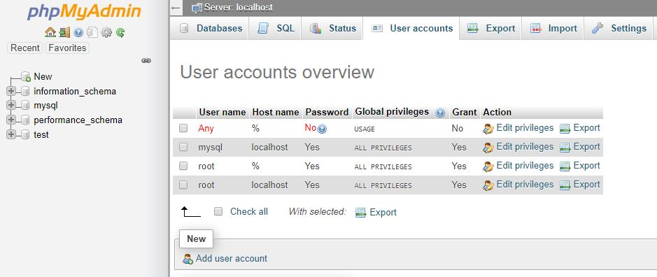

While you receive the superuser (_root_) login details when your Percona database node is created, this user isn't recommended to be used directly by your application. For your security, you should create a new user with limited permissions in phpMyAdmin.

Use the **Go to phpMyAdmin** button from the dashboard to access the admin panel and log in with the credentials you received via email.

Go to the **User accounts** tab and click **Add user account**.

The login information and privileges are defined in the following step. We recommend to create a database with the same name and grant all privileges to it - this database will be used by your application. In this case global privileges can be left empty, unless your application specifically requires more access.

For the host name field, please keep in mind that the database server is separate from your application server, so it should **not** be localhost. You should use the private IP address of your application node (found in application node **Connect** tab), or if you plan on using automatic horizontal scaling, use any host (%) so further application nodes can also access the database.

You can learn more about user management in phpMyAdmin from the [official documentation](https://docs.phpmyadmin.net/en/latest/privileges.html).