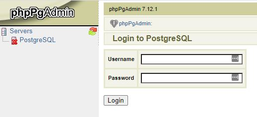
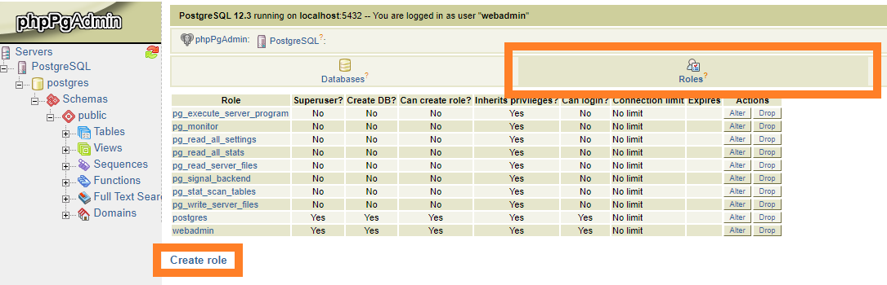

While you receive the superuser (_webadmin_) login details when your PostgreSQL database node is created, this user isn't recommended to be used directly by your application. For your security, you should create a new user with limited permissions in phpMyAdmin.

Use the **Go to pgAdmin** button from the dashboard to access the admin panel. Go to the **Servers** tab and select PostgreSQL. Log in with the credentials you received via email.

Go to the **Roles** tab and click **Create Role**.

The login information and privileges are defined in the following step. 

You can learn more about user management in phpMyAdmin from the [official documentation](https://www.postgresql.org/docs/current/sql-createrole.html).