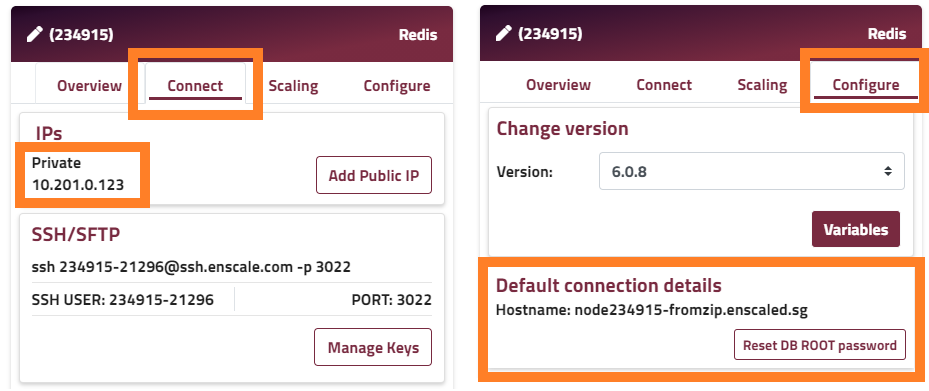

You can use the hostname or private IP address of your database node. You may also set them up as [variables](/features/environment-variables) in your application node. The advantage of the variable approach is that you can reference the variable names in your code directly so you can deploy the same app on separate environments without any change to your codebase.

Private IP address and host name can be found in the **Connect** and **Configure** tabs respectively.

!!!! We recommend using the private IP address (either directly or via the variable), as it provides a direct connection vs host name where DNS resolution is also required.

We also strongly advise that for your security you should [set up a new user](https://redis.io/topics/acl) for your application with limited privileges.