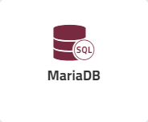
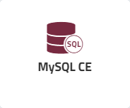
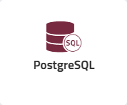
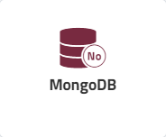
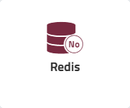

Enscale offers a variety of database nodes (servers) you can easily install from the dashboard when creating your environment or anytime after. While the database server can be in the same environment as your application node, it's important to remember that it is a separate server with its own resources and you still need to connect it to the application node.

When your database node is created, you will receive an email with access URL, login and password for the database admin panel. Keep in mind that the login and password you receive has admin permissions, so for connecting the database to your application it is strongly recommended to create a second user with less privileges.

Read more about your chosen database in the corresponding subsections:

|   |   |   |   | |   |   
|:---:|:---:|:---:|:---:|:---:|:---:|
|||||||

