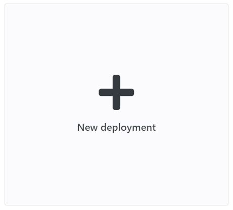
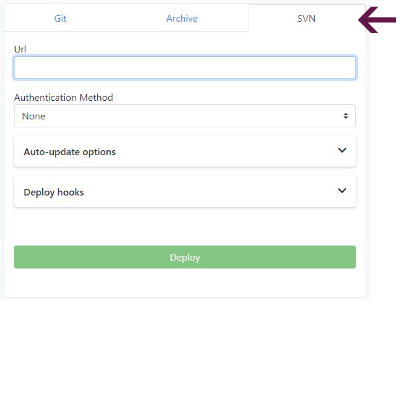

### DEPLOY FROM SVN

There are very few developers nowadays who don’t use some sort of version control system.

You can store your repository anywhere on the Internet or on your home server, as long as you are using Subversion as a source control management tool, we've got you covered!

Enscale makes life really easy for developers; we give you a way to deploy your code directly from your repository.

### Deploy your application

##### Step 1

Log in to your Enscale dashboard and create a PHP environment if you haven’t already.

##### Step 2

Enter your environment and click **Deploy** to enter the Deployment manager.

##### Step 3

Click on **New deployment** (if this is your first deployment on the environment, this step is skipped automatically).

##### Step 4

The default setting deploys to the ROOT folder, which corresponds to the default DocumentRoot in the web server configuration. If you would like to deploy to a different location, just specify a directory name (new or existing) in the **Deploy to** box.

The ROOT folder is the one the web server is preconfigured to serve content to when accessing your environment. If you deploy your application to a subfolder, you will need to set a different DocumentRoot in your httpd.conf file if you are using Apache and a different location root in nginx.conf if you have an Nginx application node.

**Apache:** `DocumentRoot "/var/www/webroot/ROOT/wordpress"`

**Nginx:** `Location / {Root /var/www/webroot/ROOT/wordpress;…}`

Unless you make the modifications mentioned above, your application will be accessible by including the subfolder in the URL, ex. http://cool-waterfall-59.uk.enscaled.com/wordpress.

If your environment has multiple applications you can configure name based virtual hosts to specify different application roots per domain.

##### Step 5

Select the **SVN tab** from the drop-down menu to provide us with a link to your repository.

**URL**: the URL of your git repository

**Authentication method**:

* None: use this if your repository does not require authentication
* Password: use this if your repository requires a username and password for access

**Auto-update**: turn this on for Enscale to check your repository regularly for updates. The frequency of checks is set by you in the auto-update interval section. If any changes are detected, Enscale will also re-deploy your application. 

**Auto-resolve conflicts**: toggle on instructs Enscale to update any contradictory files to the ones in the repository to prevent merge conflicts during re-deploy.

**Deploy hooks**: Here you can enter custom scripts to run before (Pre) or after (Post) deployment. Enter the script in the appropriate tab and click Apply to save it.

**Zero downtime**: this option is available for PHP deployments to ROOT folder. Details are [here](/php/deployments%20guide/zero-downtime-deployment).

 
##### Step 4

Click **Deploy**.

##### Handling conflicts during updates

The recommended workflow is:
* Make changes on your local development environment.
* Commit to your SVN repo. 
* Check out to your Enscale environment.

If you need to make any changes or additions directly to your Enscale environment (e.g. user-uploaded files), you should use _svn:ignore_ properties to omit them.

To protect you from unexpected data loss, Enscale does not automatically force a deployment if edits / additions made to your environment result in a merge conflict.

If you find that an updated code revision is not deployed as expected, you should review the [SVN logs](/environments/access/log-files) to identify and resolve the root cause of a merge conflict. Then try the deploy once again.

