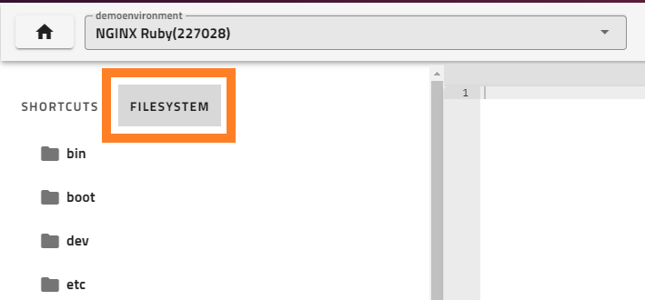
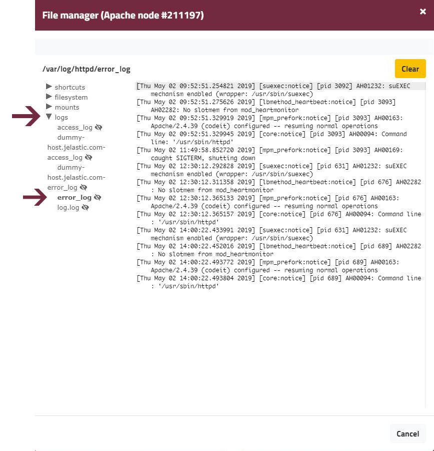
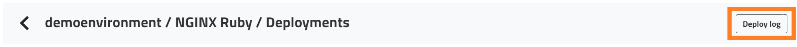
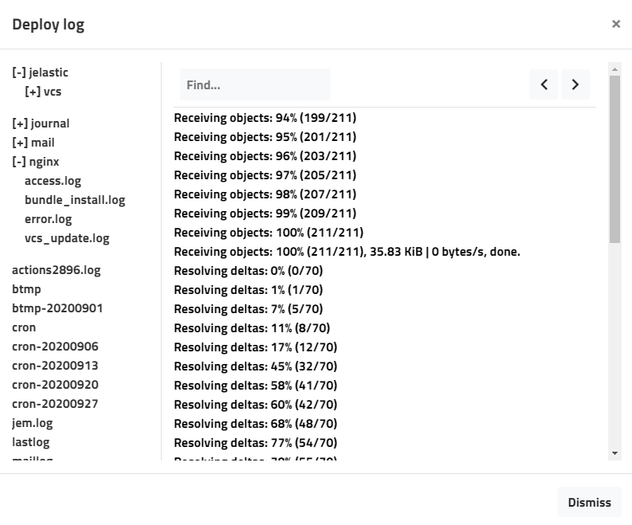

Enscale gives you easy access to your logs in the same way as your other files, using the dashboard file manager.

##### Step 1

Enter your environment.

##### Step 2
Open the **File manager** for your application node

##### Step 3

Go to the **Filesystem** and navigate to */var/log*.

##### Step 4

Click on any log file to view it.

Alternatively you can access log files in the **Deployment manager** log viewer

##### Step 1
Click the **Deploy** button from whitin your environment

##### Step 2

Click **Deploy log** in the top-right.

##### Step 3

Click on any log file to open it and use the left and right arrows to navigate between pages.

