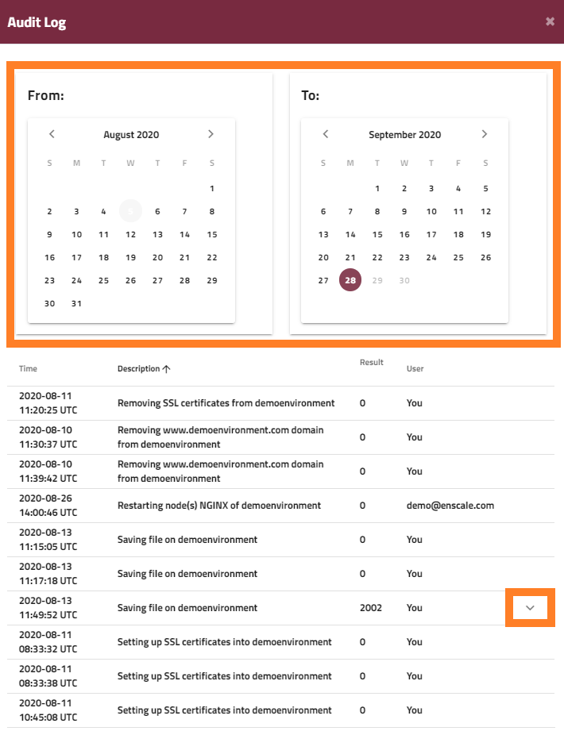

You can check past actions (performed by you or your collaborators) for each environment from the environment view.

Click on the **Actions** drop-down and select **Audit log**.

You can select a start and end date by **double clicking** the day on the corresponding *From* and *To* calendars.

You will see the timestamp, the action, status (0 for success or the error number for an error) as well as whether the action was performed in your account or that of a collaborator. You can expand the errors for additional explanation.

