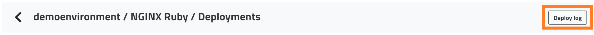
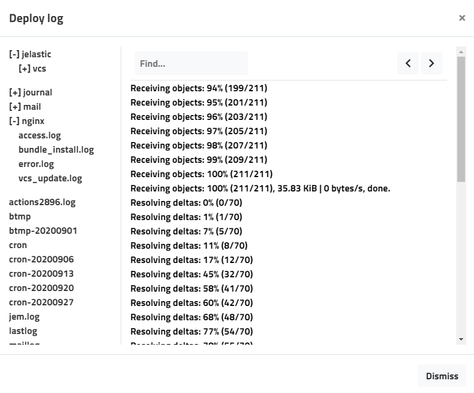

You can view your Git deployment logs (vcs_update.log) files directly from the deployment manager by following these steps:

##### Step 1

Open the deployment manager by clicking the **Deploy** button.

##### Step 2

Click **Deploy log** in the upper right-hand side to see your deployment related log files.

##### Step 3

Select the log file of your choice to view it.

