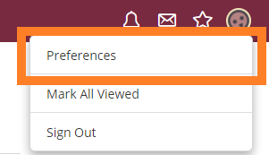
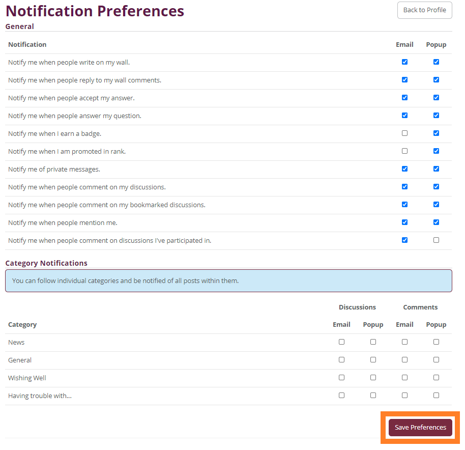

The Enscale Discussion board has two types of notifications - **Email** and **Popup**. By default we try to minimise email allerts, so emails are sent in the following situations:

* Private messages
* Comments on any discussions you've bookmarked
* Your question is answered
* An answer you've given to a question is accepted
* Rank promotions

For most everything else you should see a popup notification in case you have the Discussion Board open.

You can manage your notification settings anytime by following these steps:

##### Step 1
Click on your Avatar in the top right-hand corner and select **Preferences** from the dropdown menu.

##### Step 2
Tick the checkboxes according to your preferences

##### Step 3
Click **Save Preferences**

